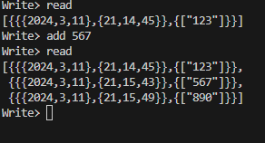

# ФП Лаб4 Голощапов Иван
## distrib data storage + CAP theorem analisys
### Цель: 
Получить навыки работы со специфичными для выбранной технологии/языка программирования приёмами.

### Общие требования:

- программа должна быть реализована в функциональном стиле;
- требуется использовать идиоматичный для технологии стиль программирования;
- задание и коллектив должны быть согласованы;
- допустима совместная работа над одним заданием.

### Содержание отчёта:

- титульный лист;
- требования к разработанному ПО, включая описание алгоритма;
- реализация с минимальными комментариями;
- ввод/вывод программы;
- выводы (отзыв об использованных приёмах программирования).

## Выполнение
В лабортаорной работе была создана распределённая система хранения данных. 

[файл с узлом системы](src/main_handler.erl)

[файл c запуском узла](src/main.erl)

### Пример работы: 
Машина 1

Машина 2

Данная система делит данные между несколькими серверами, и при этом она не повторяет их в 2 метсах.

Функция получения

Функция добавления

# Вывод
В ходе выполнения работы была построена распределённая система хранения данных.